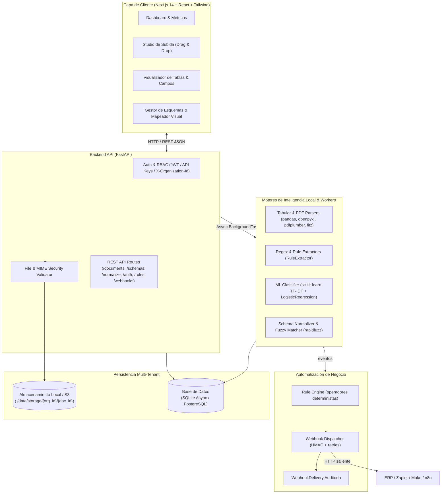

# 01 — Arquitectura del Sistema FlowMind AI

Este documento representa la fuente de verdad técnica sobre la arquitectura de software, flujo de datos y componentes de **FlowMind AI**.

---

## 1. Visión General

FlowMind AI es una plataforma SaaS multi-tenant que procesa archivos de negocio (Excel, CSV, PDF) y automatiza la extracción estructurada mediante **motores locales de Machine Learning y procesamiento determinista**, garantizando **cero fugas de datos hacia LLMs o APIs en la nube (Zero Cloud Data Leakage)**.

El sistema funciona de forma **100% autónoma en local** (usando SQLite Asíncrono, almacenamiento en disco y colas en segundo plano de FastAPI) o desplegable con PostgreSQL, Redis y MinIO/S3 en entornos productivos.



---

## 2. Componentes del Sistema

### 2.1 Backend (`backend/`)
* **Framework:** FastAPI (Python 3.11+ asíncrono).
* **Validación:** Pydantic v2 para todos los esquemas DTO de entrada y salida con tipado estricto.
* **ORM & Acceso a Datos:** SQLAlchemy v2 con soporte asíncrono nativo (`aiosqlite` en local y `asyncpg` para PostgreSQL).
* **Control de Acceso Multi-Tenant:** Aislamiento estricto por `organization_id` en persistencia y almacenamiento.

### 2.2 Motores de Inteligencia Local (`backend/app/services/`)
El procesamiento inteligente se descompone en servicios modulares sin dependencias de LLMs externos:

1. **Tabular Extractor (`TabularExtractor`):** Procesa archivos `.xlsx`, `.xls` y `.csv` usando `pandas` y `openpyxl`. Detecta delimitadores automáticamente mediante sniffing, extrae múltiples hojas y sanea inyecciones de fórmulas (`=`, `+`, `@`).
2. **PDF Extractor (`PDFExtractor`):** Usa `PyMuPDF` (`pymupdf`) para lectura de texto plano de alto rendimiento y `pdfplumber` para análisis geométrico de rejillas y extracción de tablas.
3. **Rule & Regex Extractor (`RuleExtractor`):** Extrae patrones deterministas con límites de palabra (CIF/NIF con o sin guiones, importes monetarios, fechas, emails, números de factura).
4. **Clasificador ML & Heurístico (`MLClassifier` / `RuleClassifier`):**
   * *Nivel 1 (Heurístico):* Detección por palabras clave y patrones estructurales.
   * *Nivel 2 (Machine Learning clásico):* Pipeline supervisado con `TfidfVectorizer` y clasificador `LogisticRegression` de `scikit-learn` que provee explicabilidad de características y puntuaciones de confianza.
5. **Motor de Esquemas y Normalización (`SchemaNormalizer`):**
   * Emplea `rapidfuzz` para calcular la similitud difusa entre columnas origen y campos canónicos del esquema mediante asignación óptima voraz.
   * Normaliza tipos de datos: limpieza de monedas (`1.250,50 €` ➔ `1250.5`), fechas a formato ISO (`15/06/2024` ➔ `2024-06-15`), booleanos y sanitización.
6. **Motor de Reglas de Automatización (`RuleEngine`):** Evalúa reglas de negocio deterministas sobre los resultados de extracción/normalización (`gt`, `lt`, `gte`, `lte`, `eq`, `neq`, `contains`, `is_empty`, `not_empty`) con normalización numérica incluida.
7. **Dispatcher de Webhooks (`WebhookDispatcher`):** Envía eventos HTTP salientes (extracción/normalización completadas) a ERPs o plataformas de integración, con firma HMAC opcional, timeouts y reintentos.
8. **Auditoría de Entregas (`WebhookDelivery`):** Registro persistente de cada envío con estado, código HTTP, duración y errores para trazabilidad.

### 2.3 Frontend Dashboard (`frontend/`)
* Construido con **Next.js 14+ (App Router), React 18, TypeScript y Tailwind CSS**.
* **Dashboard Principal:** Métricas en vivo (total de archivos, procesados, en cola, privacidad).
* **Upload Studio:** Zona interactiva de arrastrar y soltar con validación en cliente.
* **Visor de Documentos:** Pestañas por hoja/tabla, buscador en vivo de celdas, cuadrícula de campos normalizados y descarga en CSV/JSON.
* **Gestor de Esquemas (`/schemas`):** Constructor visual de esquemas con 4 plantillas estándar empresariales precargadas y creador de esquemas personalizados.
* **Modal de Mapeo Interactivo:** Mapeo asistido con porcentajes de afinidad y preview en tiempo real de la tabla normalizada.
* **Autenticación (`/login`):** Inicio de sesión con JWT y guard de sesión en toda la aplicación.
* **Automatización & Seguridad (`/settings`):** Gestión de API Keys, webhooks salientes y reglas de automatización, con test de entrega y evaluación dry-run.

---

## 3. Pipeline de Procesamiento de Documentos

Cada documento transita por el siguiente ciclo de vida:

```text
[UPLOAD]
   │
   ▼
[VALIDATE] ────────> Inspecciona extensión permitida, tamaño (<25MB) y MIME
   │
   ▼
[STORE] ───────────> Guarda en disco local o S3 bajo ./data/storage/{org_id}/{doc_id}/
   │
   ▼
[ENQUEUE PIPELINE] ─> Encola tarea en segundo plano sin bloquear la respuesta HTTP
   │
   ▼
[PARSE & EXTRACT] ─> Extracción de tablas (pandas/openpyxl/pdfplumber) y entidades (RuleExtractor)
   │
   ▼
[CLASSIFY] ────────> Clasificación ML (TF-IDF + LogisticRegression) con score de confianza
   │
   ▼
[PERSIST RESULTS] ─> Guarda ExtractionRecord estructurado en la base de datos local
   │
   ▼
[OPTIONAL MAPPING] ─> El usuario o workflow aplica SchemaNormalizer para exportación estandarizada
   │
   ▼
[AUTOMATION] ──────> Evalúa AutomationRule (extracción/normalización completadas)
   │
   ▼
[WEBHOOK DELIVERY] ─> Despacho HTTP saliente con HMAC + auditoría en WebhookDelivery
```

## 4. Autenticación, Multi-tenancy & Seguridad

0. **Autenticación (JWT + API Keys):** Todo endpoint `/api/v1` (salvo `login`/`register`) exige `Authorization: Bearer <jwt>` (HS256, expiración configurable) o `X-API-Key`. Las contraseñas se almacenan con PBKDF2-SHA256; las API Keys con SHA-256 del valor en claro (prefijo `fm_`).
1. **RBAC por Organización:** Roles `admin` (gestiona reglas/webhooks/esquemas), `member` (crea documentos, esquemas y API Keys) y `viewer` (solo lectura). El primer usuario de una organización es `admin`.
2. **Aislamiento en Base de Datos:** Toda entidad (`documents`, `extraction_records`, `schema_definitions`, `api_keys`, `automation_rules`, `webhook_configs`, `webhook_deliveries`) incluye una clave foránea indexada `organization_id`, y las consultas filtran siempre por la organización del contexto.
3. **Aislamiento en Disco:** Rutas estructuradas por organización: `./data/storage/{organization_id}/{document_id}/{filename}` con verificación de path traversal (`os.path.commonpath`).
4. **Privacidad Total:** 100% de inferencia y extracción ejecutada en el host local sin llamadas a APIs externas. Los webhooks salientes solo envían datos a URLs configuradas explícitamente por el administrador.
