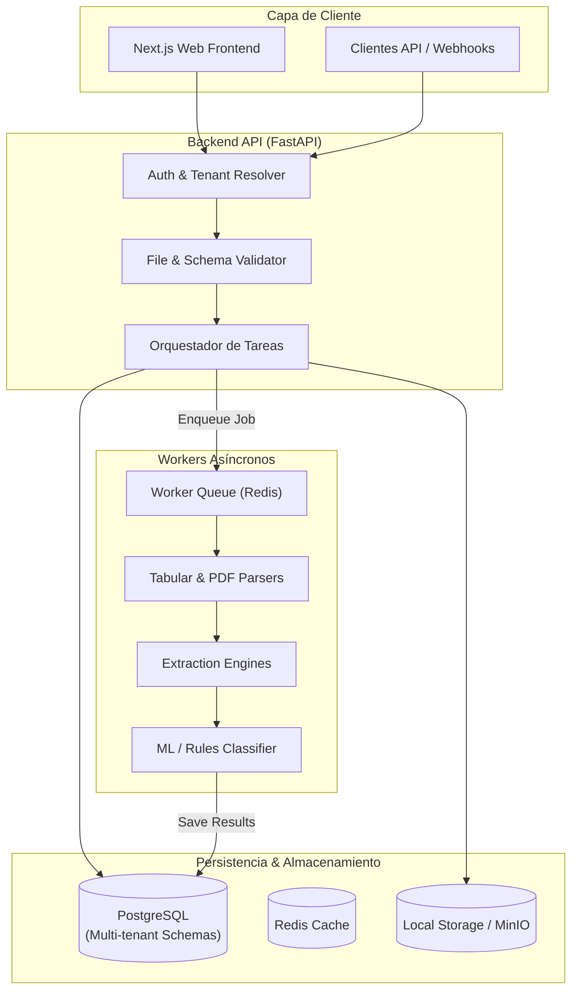

# 01 — Arquitectura del Sistema FlowMind AI

Este documento representa la fuente de verdad técnica sobre la arquitectura de software, flujo de datos y componentes de **FlowMind AI**.

---

## 1. Visión General

FlowMind AI es un sistema SaaS multi-tenant que procesa archivos de negocio (Excel, CSV, PDF) y automatiza la extracción estructurada mediante **motores locales de Machine Learning y procesamiento determinista**, sin transferir datos a LLMs de terceros en la nube.



---

## 2. Componentes del Sistema

### 2.1 Backend (`backend/`)
* **Framework:** FastAPI (Python 3.11+ asíncrono).
* **Validación:** Pydantic v2 para todos los DTOs de entrada y salida.
* **ORM & Acceso a Datos:** SQLAlchemy v2 con soporte `asyncio` y migraciones con Alembic.
* **Control de Acceso:** Aislamiento multi-tenant por `organization_id` inyectado en cada consulta de sesión.

### 2.2 Motor de Extracción e Inteligencia Local (`backend/app/services/`)
El procesamiento inteligente se descompone en servicios modulares:

1. **Tabular Extractor:** Procesa archivos `.xlsx`, `.xls` y `.csv` usando `pandas` y `openpyxl`. Detecta cabeceras ambiguas, convierte tipos de datos automáticamente y aplica sanitización.
2. **PDF Extractor:** Usa `PyMuPDF` (`fitz`) para lectura rápida de texto plano y metadatos, y `pdfplumber` para detección de rejillas y extracción de tablas complejas.
3. **Rule & Regex Extractor:** Extrae patrones específicos como CIF/NIF, códigos postales, IBANs, correos electrónicos, números de factura y fechas.
4. **Fuzzy Entity Matcher:** Utiliza `rapidfuzz` para asociar encabezados libres con el diccionario canónico de campos del esquema configurado.
5. **Clasificador ML & Heurístico:** 
   * Nivel 1: Clasificación heurística por palabras clave / metadatos.
   * Nivel 2: Clasificación supervisada clásica con `scikit-learn` (`TfidfVectorizer` + `LogisticRegression` / `MultinomialNB`).

### 2.3 Workers (`workers/`)
* Ejecutan las tareas pesadas de parsing y extracción fuera del ciclo de vida de la petición HTTP.
* Garantizan reintentos controlados e idempotencia para fallos transitorios.

### 2.4 Frontend (`frontend/`)
* Construido con Next.js (App Router), React y Tailwind CSS.
* Interfaz reactiva para subida de archivos con barra de progreso, visualizador de tablas extraídas y editor de reglas de mapeo.

---

## 3. Pipeline de Procesamiento de Documentos

Cada documento transita por un ciclo de vida bien definido:

```text
[UPLOAD]
   │
   ▼
[VALIDATE] ──> Valida MIME real, extensión y tamaño máximo (<25MB)
   │
   ▼
[STORE] ─────> Guarda en almacenamiento local o S3 con UUID aislado
   │
   ▼
[PARSE] ─────> Convierte a estructura tabular intermedia (DataFrame / Dicts)
   │
   ▼
[EXTRACT] ───> Aplica extractores deterministas, regex y fuzzy matching
   │
   ▼
[CLASSIFY] ──> Determina tipo de documento (Factura, Pedido, Inventario, Nómina)
   │
   ▼
[VALIDATE RESULT] ─> Valida el modelo contra Pydantic schemas
   │
   ▼
[PERSIST] ───> Almacena el resultado estructurado en PostgreSQL con organization_id
```

---

## 4. Multi-tenancy

* Toda tabla transaccional contiene una columna `organization_id` no nula e indexada.
* Las consultas de repositorio están parametrizadas con el tenant autenticado.
* Los archivos en almacenamiento se guardan en rutas estructuradas por organización: `storage/{organization_id}/{document_id}/{filename}`.
