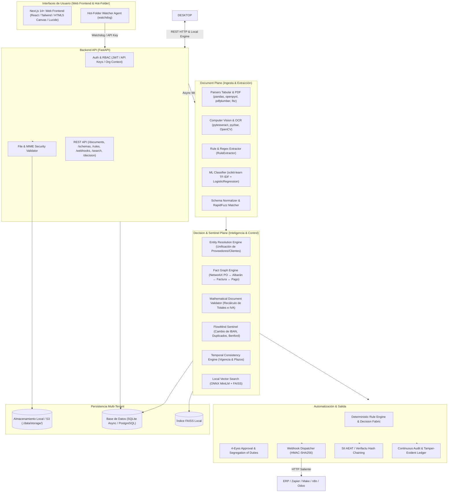

# Arquitectura Global del Sistema FlowMind AI

Este documento representa la fuente de verdad técnica sobre la arquitectura de software, flujo de datos y componentes de **FlowMind AI**.

---

## 1. Visión General: *Local Enterprise Intelligence Engine*

FlowMind AI es una plataforma de automatización de procesos empresariales e inteligencia operacional que opera bajo el principio estricto de **Zero Cloud Data Leakage (100% Local, Determinista & Private)**.

El sistema trasciende el procesamiento documental tradicional mediante una arquitectura de dos planos:
1. **Document Plane:** Ingesta multicanal, parsers locales, visión artificial offline y OCR.
2. **Decision & Sentinel Plane:** Grafo de hechos (*Fact Graph* con `NetworkX`), resolución de entidades, validador matemático determinista, detección de fraude (*FlowMind Sentinel*) y flujos de aprobación segregada.



---

## 2. Componentes del Sistema

### 2.1 Backend (`backend/`)
* **Framework:** FastAPI (Python 3.11+ asíncrono).
* **Validación:** Pydantic v2 para todos los esquemas DTO de entrada y salida con tipado estricto.
* **ORM & Acceso a Datos:** SQLAlchemy v2 con soporte asíncrono nativo (`aiosqlite` en local y `asyncpg` para PostgreSQL).
* **Control de Acceso Multi-Tenant:** Aislamiento estricto por `organization_id` en persistencia y almacenamiento.

### 2.2 Suite de Escritorio (`desktop/` — PySide6 / Qt6)
* **`FlowMind Desktop`:** Aplicación nativa independiente con visor gráfico de PDFs acelerado por hardware y tabla virtual `QAbstractTableModel`.
* **`Hot-Folder Tray Agent`:** Agente en segundo plano en la bandeja del sistema que monitoriza carpetas y procesa archivos desatendidamente.
* **`Visual Annotation Studio`:** Canvas interactivo (`QGraphicsView`) para definir áreas de extracción geométrica en documentos escaneados o facturas.
* **`Reconciliation Grid Pro`:** Grid contable de alta velocidad con soporte de diffing y comparación visual de inventarios y pedidos.

### 2.3 Motores del Document Plane & Decision Plane
1. **Tabular Extractor (`TabularExtractor`):** Procesa archivos `.xlsx`, `.xls` y `.csv` usando `pandas` y `openpyxl`. Detecta delimitadores automáticamente, extrae múltiples hojas y sanea inyecciones de fórmulas (`=`, `+`, `@`).
2. **PDF Extractor (`PDFExtractor`):** Usa `PyMuPDF` (`fitz`) para lectura de texto de alto rendimiento y `pdfplumber` para análisis geométrico de rejillas y extracción de tablas.
3. **Visión Artificial, Barcodes & OCR (`VisionExtractor`):**
   * Decodificación 1D/2D instantánea con `pyzbar` / `zxing-cpp` (QR fiscales, Code 128).
   * OCR local con `pytesseract` / `easyocr` y binarización adaptativa para PDFs escaneados y fotos de tickets.
   * Detección de casillas (*OMR*) con OpenCV para formularios de inspección y checklists.
4. **Motor de Resolución de Entidades (`EntityResolutionEngine`):** Unifica variantes de proveedores/clientes usando ponderación multidimensional (CIF, nombre difuso, IBAN, dominio de email).
5. **Grafo de Hechos Empresariales (`FactGraphEngine` con `NetworkX`):** Conecta pedidos, albaranes, facturas, proyectos y pagos en un grafo dirigido para razonamiento relacional.
6. **Validador Matemático (`MathematicalDocumentValidator`):** Recalcula deterministamente bases imponibles, cuotas de IVA, recargos y retenciones, alertando de inconsistencias aritméticas.
7. **FlowMind Sentinel (`FlowMindSentinel`):** Motor antifraude especializado (alerta de cambio de IBAN, detección multidimensional de duplicados, patrones de evasión de umbrales y análisis de Benford).
8. **Búsqueda Semántica Local (`LocalVectorSearch`):** Embeddings cuantizados ONNX `MiniLM` ejecutados en CPU local con índice `FAISS` para búsqueda documental en lenguaje natural.
9. **Decision Fabric & Aprobación 4-Ojos:** Enrutamiento por puntuación compuesta de confianza y segregación estricta de funciones (*Segregation of Duties*).
10. **Cumplimiento Fiscal & Hash Chaining (`ComplianceEngine`):** Generador de ficheros XML oficiales para el **SII de la AEAT** y sellado encadenado inmutable de facturas (*Veri\*factu / TicketBAI*).

---

## 3. Pipeline Integral de Procesamiento y Decisión

El flujo de procesamiento se ejecuta de manera determinista y por capas desacopladas:

```text
[UPLOAD / HOT-FOLDER]
   │
   ▼
[VALIDATE & SANITIZE] ───> Cabeceras binarias (MIME real), tamaño y protección anti-fórmula
   │
   ▼
[STORE] ─────────────────> Almacenamiento local aislado en ./data/storage/{org_id}/{doc_id}/
   │
   ▼
[DECODE QR / OCR] ───────> Lectura de códigos 1D/2D (zxing-cpp); OCR adaptativo si no hay capa de texto
   │
   ▼
[PARSE & EXTRACT] ───────> Extracción tabular (pandas/pdfplumber) y campos clave (RuleExtractor / MLClassifier)
   │
   ▼
[ENTITY RESOLUTION] ─────> Unificación de proveedor/cliente contra base canónica local (EntityResolutionEngine)
   │
   ▼
[FACT GRAPH MAPPING] ────> Vinculación en el grafo de hechos (PO ↔ Albarán ↔ Factura ↔ Pago)
   │
   ▼
[MATHEMATICAL VALIDATION]> Recálculo determinista de líneas, bases e impuestos (MathematicalDocumentValidator)
   │
   ▼
[FLOWMIND SENTINEL] ─────> Verificación de cambio de IBAN, duplicidad y riesgo de fraude
   │
   ▼
[DECISION FABRIC] ───────> Aprobación automática desatendida o enrutamiento a revisión 4-Ojos
   │
   ▼
[DISPATCH & AUDIT] ──────> Envío HTTP saliente (HMAC) + Sellado hash inmutable en ledger local (Verifactu)
```

---

## 4. Gobernanza y Seguridad Multi-Tenant

1. **Aislamiento Multi-Tenant Estricto:** Toda entidad en base de datos y toda ruta en disco está aislada por `organization_id`.
2. **Autenticación Fuerte:** Tokens JWT (HS256) y API Keys (`fm_...`) con almacenamiento exclusivamente hasheado (SHA-256).
3. **Privacidad Absoluta:** Cero transmisión de datos a APIs externas. Todo cálculo ocurre en el host del usuario.
