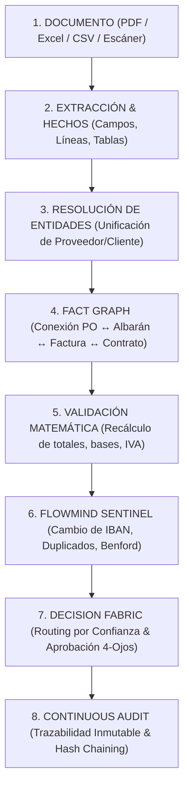
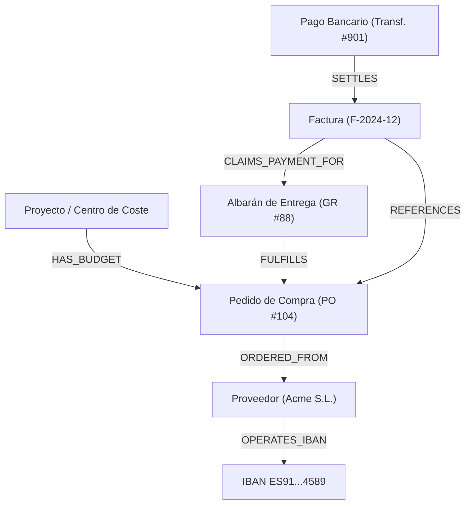

# Motor de Decisión Empresarial, Grafo de Hechos & Sentinel

Este documento define la arquitectura técnica del **Motor de Decisión Empresarial**, el **Grafo de Hechos Locales (*Fact Graph*)**, el **Validador Matemático** y el sistema antifraude **FlowMind Sentinel**, transformando FlowMind AI de un procesador documental a una plataforma de inteligencia operacional privada y determinista.

---

## 1. Filosofía de Diseño: *Evidence ➔ Facts ➔ Validation ➔ Risk ➔ Decision*

---

## 2. Motor de Resolución de Entidades (`EntityResolutionEngine`)

### 2.1 Problema
Un mismo proveedor o cliente aparece con múltiples variantes tipográficas en los documentos:
* *"Microsoft Corporation S.L."*
* *"Microsoft Corp."*
* *"MICROSOFT IBERICA S.R.L."*
* *"Microsoft España"*

### 2.2 Algoritmo de Puntuación Ponderada
El motor resuelve y unifica entidades calculando una puntuación de afinidad compuesta $S \in [0.0, 1.0]$:

$$S = w_{\text{tax}} \cdot C_{\text{tax}} + w_{\text{name}} \cdot C_{\text{name}} + w_{\text{iban}} \cdot C_{\text{iban}} + w_{\text{domain}} \cdot C_{\text{domain}} + w_{\text{phone}} \cdot C_{\text{phone}}$$

* **$C_{\text{tax}}$ (NIF / CIF):** Coincidencia exacta o con formato normalizado ($w_{\text{tax}} = 0.45$).
* **$C_{\text{name}}$ (Razón Social):** Coincidencia difusa `fuzz.token_sort_ratio` ($w_{\text{name}} = 0.25$).
* **$C_{\text{iban}}$ (IBAN Bancario):** Coincidencia contra cuentas históricas registradas ($w_{\text{iban}} = 0.15$).
* **$C_{\text{domain}}$ (Dominio de Email):** Coincidencia de dominio corporativo ($w_{\text{domain}} = 0.10$).
* **$C_{\text{phone}}$ (Teléfono Normalizado):** Coincidencia E.164 ($w_{\text{phone}} = 0.05$).

### 2.3 Acciones según Umbral
* **$S \ge 0.90$:** `AUTO_MERGE` (Asigna automáticamente al `entity_id` canónico existente).
* **$0.70 \le S < 0.90$:** `FLAG_FOR_REVIEW` (Sugerencia al operador humano en el Workbench).
* **$S < 0.70$:** `CREATE_NEW_ENTITY` (Registra una nueva entidad en la base de datos local).

---

## 3. Validador Matemático Determinista (`MathematicalDocumentValidator`)

### 3.1 Recálculo Aritmético Integral
El validador no confía en los totales impresos en el documento; recalcula de forma determinista cada componente:

1. **Base Imponible por Línea:**
   $$\text{BaseLínea}_i = \text{Cantidad}_i \times \text{PrecioUnitario}_i \times (1 - \text{DescuentoPct}_i / 100)$$

2. **Base Imponible Total:**
   $$\text{BaseTotalCalculada} = \sum_{i=1}^{N} \text{BaseLínea}_i$$

3. **Cuotas de IVA y Recargo de Equivalencia:**
   $$\text{CuotaIVA}_k = \text{BaseAgrupada}_k \times \text{TipoIVA}_k$$
   $$\text{CuotaRE}_k = \text{BaseAgrupada}_k \times \text{TipoRE}_k$$

4. **Total General Esperado:**
   $$\text{TotalEsperado} = \text{BaseTotalCalculada} + \sum \text{CuotaIVA} + \sum \text{CuotaRE} - \text{RetenciónIRPF} + \text{GastosEnvío}$$

### 3.2 Detección de Discrepancias
$$\Delta = |\text{TotalDocumento} - \text{TotalEsperado}|$$

* **$\Delta \le 0.02$ €:** `OK` (Desviación atribuible a diferencias de redondeo por línea).
* **$0.02 < \Delta \le 1.00$ €:** `ROUNDING_WARNING` (Aviso de redondeo contable).
* **$\Delta > 1.00$ €:** `MATHEMATICAL_INCONSISTENCY` (Severidad **CRITICAL**: Bloqueo automático para revisión).

---

## 4. FlowMind Sentinel: Motor Antifraude y Detección de Anomalías

### 4.1 Sentinel de Cambio de Cuenta Bancaria (*Bank Account Change Sentinel*)
* **Riesgo:** Ataque de suplantación de proveedor (*Vendor Impersonation / CEO Fraud*), donde una factura legítima es alterada con el IBAN del atacante.
* **Mecanismo:**
  1. Al extraer una factura del `Proveedor X`, se consulta la tabla de cuentas bancarias históricas validadas.
  2. Si el IBAN no existe en el histórico del proveedor:
     * Emite evento `BANK_ACCOUNT_CHANGE_DETECTED` con severidad **CRITICAL**.
     * Bloquea la aprobación automática y notifica al responsable financiero con requerimiento de validación telefónica/fuera de banda.

### 4.2 Detección Multidimensional de Facturas Duplicadas
* En lugar de comparar solo el número de factura, genera una **huella multidimensional**:
  $$\text{Fingerprint} = \text{SHA256}(\text{VendorTaxId} \,\|\, \text{CleanInvoiceNumber} \,\|\, \text{InvoiceDate} \,\|\, \text{TotalAmount})$$
* **Detección Difusa:** Si el número de factura es ligeramente distinto (ej. `F-2024/09` vs `F2024-09`) pero el proveedor, importe exacto y fecha coinciden en un rango de $\pm 3$ días, se marca como `SUSPECTED_DUPLICATE`.

### 4.3 Detección de Evasión de Umbrales de Aprobación (*Threshold Avoidance*)
* Analiza series temporales de transacciones de un mismo emisor o departamento.
* Si el umbral de aprobación ejecutiva es de $10.000$ € y se detectan múltiples facturas consecutivas de importes entre $9.800$ € y $9.990$ €, se dispara la alerta `THRESHOLD_AVOIDANCE_PATTERN`.

### 4.4 Análisis de Ley de Benford
* En lotes contables masivos ($N > 500$ transacciones), calcula la distribución del primer dígito significativo $d \in \{1, \dots, 9\}$:
  $$P(d) = \log_{10}\left(1 + \frac{1}{d}\right)$$
* Desviaciones significativas mediante test $\chi^2$ (Chi-cuadrado) identifican anomalías estructurales en facturación o gastos sin soporte.

---

## 5. Grafo de Hechos Empresariales (`FactGraphEngine` con `NetworkX`)

### 5.1 Estructura del Grafo Local
FlowMind construye un grafo dirigido acíclico (DAG) de relaciones transaccionales en memoria y persistido en SQLite/PostgreSQL:

### 5.2 Consultas de Razonamiento sobre el Grafo
* **Factura Huérfana:** Identificar facturas sin pedido previo asociado.
* **Sobrefacturación Acumulada:** Calcular si la suma de todas las facturas vinculadas al `PO #104` supera el importe total autorizado en el pedido.
* **Conflicto de Intereses / Segregación de Funciones:** Detectar si el usuario que creó la orden de compra es el mismo que aprueba el pago de la factura.

---

## 6. Motor de Consistencia Temporal (`TemporalConsistencyEngine`)

Evalúa la secuencia lógica y cronológica de los hechos empresariales:

| Regla Temporal | Condición Válida | Violación / Alerta |
| :--- | :--- | :--- |
| **Secuencia de Compra** | $\text{Fecha(PO)} \le \text{Fecha(Albarán)} \le \text{Fecha(Factura)}$ | *Albarán anterior a la emisión del pedido* |
| **Vigencia de Contrato** | $\text{InicioContrato} \le \text{FechaFactura} \le \text{FinContrato}$ | *Facturación posterior al vencimiento del contrato* |
| **Plazo de Pago (Ley de Morosidad)** | $\text{FechaVencimiento} - \text{FechaEmision} \le 60\text{ días}$ | *Plazo de pago superior al límite legal* |
| **Facturación Anticipada** | $\text{FechaFactura} \le \text{FechaActual}$ | *Factura con fecha futura emitida por error* |

---

## 7. Flujos Human-in-the-Loop & Aprobación Segregada (`DecisionFabric`)

### 7.1 Puntuación Compuesta de Decisión (*Decision Score*)
Una factura o documento solo se aprueba de forma 100% desatendida si el vector de señales cumple todos los umbrales:

$$\text{DecisionScore} = \min(\text{Conf}_{\text{OCR}}, \text{Conf}_{\text{Class}}, \text{Conf}_{\text{Match}}, \text{Conf}_{\text{Math}}) \times (1 - \text{Risk}_{\text{Sentinel}})$$

* Si $\text{DecisionScore} \ge 0.95$ y $\text{Total} \le \text{UmbralOrg}$: **AUTO_APPROVE**.
* Si $\text{DecisionScore} < 0.95$ o $\text{Risk}_{\text{Sentinel}} > 0$: **ROUTE_TO_HUMAN_REVIEW**.

### 7.2 Aprobación a Cuatro Ojos (*Four-Eyes Principle*)
* Para importes elevados o transacciones con alertas leves, se exige la firma de dos roles independientes:
  1. **Analista / Revisor:** Valida la coherencia de datos en el Workbench.
  2. **Aprobador / CFO:** Autoriza el pago definitivo.
* Regla estricta de Segregación de Funciones (*SoD*): $\text{UsuarioCreacion} \neq \text{UsuarioAprobacion}$.

### 7.3 Simulador de Reglas de Negocio (*Business Process Simulator*)
Permite al administrador probar una nueva regla contra los últimos 10.000 documentos procesados en la base de datos histórica para predecir:
* Tasa de aprobación automática esperada (%).
* Número de excepciones manuales generadas.
* Detección de posibles falsos positivos antes del despliegue en producción.
