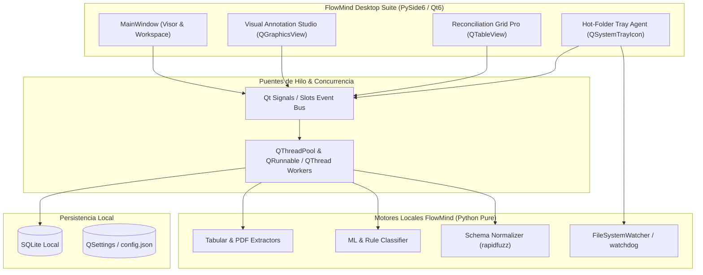

# Arquitectura de la Suite de Escritorio PySide6 (Qt para Python)

Este documento define la arquitectura técnica, diseño de interfaz y ciclo de vida de la suite de escritorio nativa de **FlowMind AI** construida con **PySide6 (Qt 6)**.

---

## 1. Visión General & Objetivos

La suite de escritorio de FlowMind AI provee una experiencia nativa de alto rendimiento orientada a:
1. **Entornos Air-Gapped / Ultra-Privados:** Procesamiento local sin requerir navegador web, servidor HTTP externo ni dependencias de nube.
2. **Automatización Desatendida en Puestos de Trabajo:** Monitorización en segundo plano de carpetas locales y de red (*Hot-Folders*).
3. **Estudio Visual de Anotación de Plantillas:** Definición gráfica interactiva de regiones de extracción geométrica (*Bounding Boxes*).
4. **Grid de Conciliación de Alto Rendimiento:** Manipulación fluida de cientos de miles de registros tabulares con soporte de diffing visual.



---

## 2. Componentes de la Suite PySide6

### 2.1 `FlowMind Desktop` (Aplicación Principal)
* **Arquitectura de UI:** Basada en `QMainWindow` con navegación lateral (`QListWidget` estilizado) y paneles desacoplados mediante `QStackedWidget`.
* **Visor de PDF con Aceleración Gráfica:**
  * Renderizado mediante `PyMuPDF` (`fitz.Pixmap`) convertido a `QPixmap` o `QtPdf` integrado.
  * Soporte de zoom fluido, navegación por páginas y superposición de capas vectoriales para resaltar campos detectados (bounding boxes interactivos).
* **Visor de Hojas de Cálculo:** `QTableView` con modelo virtual derivado de `QAbstractTableModel` que carga datos bajo demanda sin bloquear el hilo principal.
* **Integración Asíncrona (Non-Blocking UI):**
  * Toda extracción pesada, inferencia ML o lectura de disco se ejecuta en workers `QRunnable` administrados por `QThreadPool.globalInstance()`.
  * La comunicación con la interfaz se realiza exclusivamente mediante `Signal` y `Slot` tipados.

### 2.2 `Hot-Folder Tray Agent` (Agente de Bandeja de Sistema)
* **Objetivo:** Ejecutarse silenciosamente en segundo plano en los ordenadores de contabilidad o almacén.
* **Componentes:**
  * `QSystemTrayIcon`: Menú contextual para pausar/reanudar, abrir carpeta de entrada/salida y ver estadísticas de procesamiento.
  * `QFileSystemWatcher` o librería `watchdog`: Detección en tiempo real de nuevos archivos depositados en carpetas monitorizadas (`C:\Facturas_Entrada`).
  * **Cola de Procesamiento Local:** Extrae, normaliza contra el esquema predeterminado y guarda el resultado en una carpeta destino (`C:\Facturas_Salida\datos.xlsx`) o lo envía al backend vía REST API con API Key (`X-API-Key: fm_...`).
  * **Notificaciones Nativas:** Emisión de `QSystemTrayIcon.showMessage()` informando del éxito o alerta en el procesamiento de cada archivo.

### 2.3 `Visual Template & Annotation Studio`
* **Objetivo:** Permitir a usuarios no técnicos diseñar plantillas de extracción determinista dibujando sobre documentos reales.
* **Implementación Técnica:**
  * Basado en `QGraphicsView` y `QGraphicsScene`.
  * Elementos gráficos personalizados (`QGraphicsRectItem` interactivos con manejadores de redimensión).
  * Asignación de tipos de campo a cada caja: *Cabecera*, *Proveedor*, *Tabla de Líneas*, *Base Imponible*, *IVA*, *Total*.
  * **Exportación de Plantillas:** Genera un archivo `.json` de reglas geométricas que `RuleExtractor` y `PDFExtractor` pueden cargar para parsear documentos idénticos al 100% de precisión.

### 2.4 `Reconciliation Grid Pro` (Grid de Conciliación & Diffing)
* **Objetivo:** Comparar dos conjuntos de datos tabulares (ej. Inventario ERP vs Inventario Físico de Proveedor, o Pedido vs Factura).
* **Capacidades:**
  * `QAbstractTableModel` con caché de filas para soportar más de 500.000 filas con scroll instantáneo a 60 FPS.
  * **Motor de Diffing Visual:** Resalta en rojo celdas con discrepancia de importe o cantidad, en verde filas concordantes y en amarillo elementos no encontrados.
  * **Edición en Celda & Atajos Contables:** Navegación por teclado tipo Excel (Tab, Enter, F2 para editar, Ctrl+Z para deshacer).

---

## 3. Estructura de Proyecto Propuesta (`desktop/`)

```text
desktop/
├── assets/
│   ├── icons/            # Iconos SVG y PNG de alta resolución
│   └── styles.qss        # Hoja de estilos Qt (Tema Oscuro Moderno)
├── controllers/
│   ├── app_controller.py # Orquestador principal de la app
│   ├── tray_controller.py# Controlador del agente de bandeja
│   └── worker.py         # Workers QRunnable para extracción asíncrona
├── models/
│   ├── table_model.py    # QAbstractTableModel de alto rendimiento
│   └── document_model.py # Adaptador de dominio Document/ExtractionRecord
├── views/
│   ├── main_window.py    # Ventana principal y layout
│   ├── pdf_viewer.py     # Visor gráfico de PDF interactivo
│   ├── table_viewer.py   # Vista de cuadrícula de datos
│   ├── studio_view.py    # Canvas de anotación de plantillas
│   └── settings_dialog.py# Diálogo de configuración y Hot-Folders
├── main.py               # Punto de entrada de la aplicación PySide6
└── pyproject.toml        # Dependencias de escritorio (PySide6, watchdog)
```

---

## 4. Estrategia de Empaquetado y Distribución

Para garantizar despliegues sencillos en empresas sin necesidad de instalar Python:

1. **Compilación Nativa con Nuitka / PyInstaller:**
   * Generación de un ejecutable único autocontenido: `FlowMind.exe` (Windows) y binarios para Linux / macOS.
2. **Instalador MSI / InnoSetup:**
   * Instalación opcional con auto-inicio en arranque de Windows (para el `Hot-Folder Tray Agent`).
3. **Modo Portable USB:**
   * Carpeta portable con SQLite embebido para auditorías in-situ en entornos aislados.
