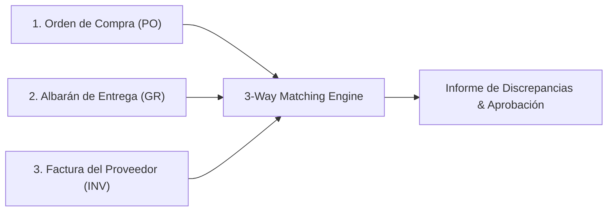

# Motores Especializados de Procesamiento y Conciliación

Este documento especifica los algoritmos, lógica de negocio y arquitectura de los **motores avanzados de procesamiento determinista y conciliación** de **FlowMind AI**.

---

## 1. Motor de Conciliación a 3 Vías (*3-Way Matching Engine*)

### 1.1 Objetivo del Negocio
En el ciclo de compras empresariales (*Procure-to-Pay*), la autorización de pago de una factura requiere validar tres documentos de origen:
1. **Orden de Compra / Pedido (Purchase Order - PO):** Define qué se pidió y a qué precio pactado.
2. **Albarán de Entrega (Goods Receipt / Packing Slip):** Define qué mercancía física entró realmente en el almacén.
3. **Factura del Proveedor (Vendor Invoice):** Reclama el cobro por los artículos entregados.

### 1.2 Algoritmo de Emparejamiento por Líneas
El motor `ThreeWayMatcher` cruza los tres documentos mediante el siguiente flujo determinista:
1. **Normalización de Códigos:** Limpieza de espacios y normalización de códigos de artículo/SKU y descripciones mediante `fuzz.token_sort_ratio`.
2. **Validación de Cantidades:** $\text{Cantidad Facturada} \le \text{Cantidad en Albarán} \le \text{Cantidad Pedida}$.
   * Si $\text{Cantidad Facturada} > \text{Cantidad Recibida}$, se marca alerta de *Sobrefacturación de Unidades*.
3. **Validación de Precios Unitarios:** $\text{Precio Unitario Factura} == \text{Precio Unitario PO} \pm \text{Tolerancia (ej. 0.01€)}$.
4. **Estados de Conciliación:** `MATCHED_EXACT`, `MATCHED_WITH_TOLERANCE`, `DISCREPANCY_QUANTITY`, `DISCREPANCY_PRICE`, `UNMATCHED_ITEMS`.

---

## 2. Parser Bancario Norma 43 (España)

* Parsea registros estándar de longitud fija de 80 caracteres (Registros 11, 22, 23 y 33).
* Extrae movimientos bancarios, fechas de valor y conceptos para conciliación automática con facturas emitidas y recibidas.

---

## 3. Visión Artificial Local: Barcodes, QR Codes y OMR

* **Decodificador 1D/2D (`zxing-cpp` / `pyzbar`):** Lectura nativa directa de códigos QR fiscales (TicketBAI, Veri\*factu) y códigos de barras Code 128 / EAN-13.
* **Optical Mark Recognition (OMR):** Detección de casillas de verificación marcadas en partes de trabajo con OpenCV (`findContours`).
* **Four-Point Perspective Transform:** Enderezado geométrico automático y binarización adaptativa para fotografías móviles de documentos.

---

## 4. Desagregador Masivo de Nóminas en PDF (*Payroll Splitter*)

* Segmentación automática de ficheros PDF consolidados de nóminas en documentos individuales por trabajador mediante detección de cambios de NIF/NIE en la capa vectorial.
