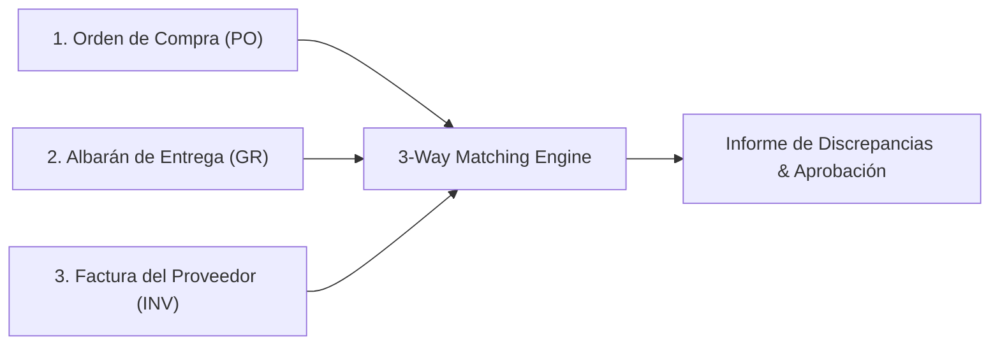

# 06 — Motores de Procesamiento Avanzado & Conciliación

Este documento especifica los algoritmos, lógica de negocio y arquitectura de los **motores avanzados de procesamiento determinista y conciliación** de **FlowMind AI**.

---

## 1. Motor de Conciliación a 3 Vías (*3-Way Matching Engine*)

### 1.1 Objetivo del Negocio
En el ciclo de compras empresariales (*Procure-to-Pay*), la autorización de pago de una factura requiere validar tres documentos de origen:
1. **Orden de Compra / Pedido (Purchase Order - PO):** Define qué se pidió y a qué precio pactado.
2. **Albarán de Entrega (Goods Receipt / Packing Slip):** Define qué mercancía física entró realmente en el almacén.
3. **Factura del Proveedor (Vendor Invoice):** Reclama el cobro por los artículos entregados.



### 1.2 Algoritmo de Emparejamiento por Líneas
El motor `ThreeWayMatcher` cruza los tres documentos mediante el siguiente flujo determinista:
1. **Normalización de Códigos:** Limpieza de espacios y normalización de códigos de artículo/SKU y descripciones mediante `fuzz.token_sort_ratio`.
2. **Validación de Cantidades:** $\text{Cantidad Facturada} \le \text{Cantidad en Albarán} \le \text{Cantidad Pedida}$.
   * Si $\text{Cantidad Facturada} > \text{Cantidad Recibida}$, se marca alerta de *Sobrefacturación de Unidades*.
3. **Validación de Precios Unitarios:** $\text{Precio Unitario Factura} == \text{Precio Unitario PO} \pm \text{Tolerancia (ej. 0.01€)}$.
   * Si hay variación de precio, se calcula el impacto económico total de la desviación.
4. **Estado de Conciliación:**
   * `MATCHED_EXACT`: 100% de coincidencia en líneas, cantidades y precios.
   * `MATCHED_WITH_TOLERANCE`: Coincidencia dentro de los umbrales configurados.
   * `DISCREPANCY_QUANTITY`: Discrepancia en unidades recibidas vs facturadas.
   * `DISCREPANCY_PRICE`: Variación no autorizada en el precio unitario.
   * `UNMATCHED_ITEMS`: Artículos presentes en la factura que no constan en el pedido original.

---

## 2. Parser Bancario & Conciliación de Tesorería (Norma 43 / CAMT.053)

### 2.1 Estándar CSB 43 / Norma 43 (España)
La Norma 43 es el formato estándar de extractos bancarios en España estructurado en registros de longitud fija (80 caracteres):
* **Registro 11 (Cabecera de Cuenta):** Código de entidad, sucursal, número de cuenta, fecha inicial, divisa y saldo inicial.
* **Registro 22 (Movimiento Principal):** Fecha de operación, fecha de valor, concepto propio, concepto común, importe (con signo) y número de documento.
* **Registro 23 (Concepto Complementario):** Hasta 5 líneas de texto libre con el detalle del concepto y remitente/destinatario.
* **Registro 33 (Fin de Cuenta):** Saldo final y número de apuntes.

### 2.2 Motor de Conciliación de Facturas con Extracto Bancario
1. **Extracción de Movimientos:** Parsea los registros 22 y 23 extrayendo importes, fechas y cadenas de texto del concepto.
2. **Emparejamiento con Facturas Emitidas / Recibidas:**
   * Búsqueda por importe exacto.
   * Búsqueda difusa del número de factura o CIF en el texto del concepto.
   * Ventana temporal: La fecha de valor debe estar comprendida entre la fecha de factura y la fecha de vencimiento + $N$ días de gracia.
3. **Generación de Asiento de Cobro / Pago:** Emite el registro contable normalizado para su integración directa en el ERP.

---

## 3. Visión Artificial Local: Barcodes, QR Codes y OMR

### 3.1 Decodificador Nativo 1D/2D (`pyzbar` / `zxing-cpp`)
* **Proceso de Detección:**
  * Escaneo de cada página/imagen antes del OCR textual.
  * Localización y decodificación automática de:
    * **1D:** Code 128, Code 39, EAN-13 (códigos de barras de producto y albaranes de paquetería).
    * **2D:** QR Codes, DataMatrix (formatos fiscales como *TicketBAI*, *Veri\*factu*, *Swiss QR-bill*).
* **Extracción Estructurada Directa:** Si el QR contiene un payload estándar (ej. URL con parámetros fiscales o XML incrustado), se extrae directamente con **100% de fidelidad y cero error de interpretación**.

### 3.2 Detector de Casillas y Formularios (*OMR - Optical Mark Recognition*)
* **Algoritmo de Detección:**
  1. Detección de contornos cuadrados/circulares mediante OpenCV (`findContours`).
  2. Filtrado por relación de aspecto ($1.0 \pm 0.1$) y dimensiones mínimas/máximas.
  3. Cálculo de la densidad de píxeles negros / umbral de relleno en el área interior de la casilla:
     $$\text{Fill Ratio} = \frac{\sum \text{Píxeles Activos}}{\text{Área Total del Contorno}}$$
  4. Si $\text{Fill Ratio} > 0.35$, la casilla se marca como `CHECKED = true`.

### 3.3 Optimizador de Fotos Móviles (*Mobile Dewarping*)
* **Pipeline de Preprocesamiento:**
  1. Filtro Gaussiano y detección de bordes Canny.
  2. Búsqueda del contorno cuadrilátero más grande (perímetro del papel).
  3. **Transformación de Perspectiva (Four-Point Transform):** Mapeo de las 4 esquinas a un rectángulo plano orientado.
  4. **Binarización Adaptativa (Sauvola / Otsu):** Eliminación de sombras proyectadas y uniformización de la iluminación.

---

## 4. Desagregador Masivo de Nóminas en PDF (*Payroll Splitter*)

### 4.1 Problema
Las asesorías laborales generan mensualmente un único fichero PDF consolidado con todas las nóminas de la empresa (ej. 300 páginas con 300 nóminas consecutivas).

### 4.2 Arquitectura del `PayrollSplitter`
1. **Detección de Saltos de Documento:** Analiza cada página del PDF buscando el identificador único del trabajador (cambio de NIF/NIE o número de afiliación a la Seguridad Social).
2. **Segmentación de Páginas:** Agrupa las páginas correspondientes a cada trabajador (nóminas de 1 o múltiples hojas).
3. **Generación de Archivos Individuales:**
   * Nombre de archivo estandarizado: `Nomina_{AÑO}_{MES}_{NIF}_{NOMBRE_APELLIDOS}.pdf`.
   * Cifrado con contraseña opcional (basada en los últimos 4 dígitos del DNI).
4. **Cuadro de Mando de Costes:** Genera un consolidado en Excel con los devengos, IRPF retenido, cotizaciones y líquido total de la nómina mensual.

---

## 5. Memoria de Mapeo por Proveedor (*Vendor Mapping Memory*)

### 5.1 Concepto
Almacenar perfiles de mapeo asociados al identificador fiscal del proveedor (CIF/NIF o Dominio de Email).

### 5.2 Estructura del Perfil de Proveedor (`VendorMappingProfile`)
```json
{
  "vendor_tax_id": "ESB12345678",
  "vendor_name": "Suministros Industriales S.L.",
  "target_schema_id": "preset-invoices-std",
  "fixed_column_mappings": {
    "sku": "Cod_Art",
    "description": "Concepto",
    "quantity": "Uds",
    "unit_price": "Precio_Ud",
    "total": "Importe_Total"
  },
  "custom_rules": {
    "default_tax_rate": 0.21,
    "header_row_offset": 2
  }
}
```

### 5.3 Comportamiento en Ingesta
Cuando el clasificador o `RuleExtractor` detecta el CIF `ESB12345678`, el pipeline consulta la memoria de proveedores y aplica directamente las reglas fijas sin requerir intervención del usuario.
