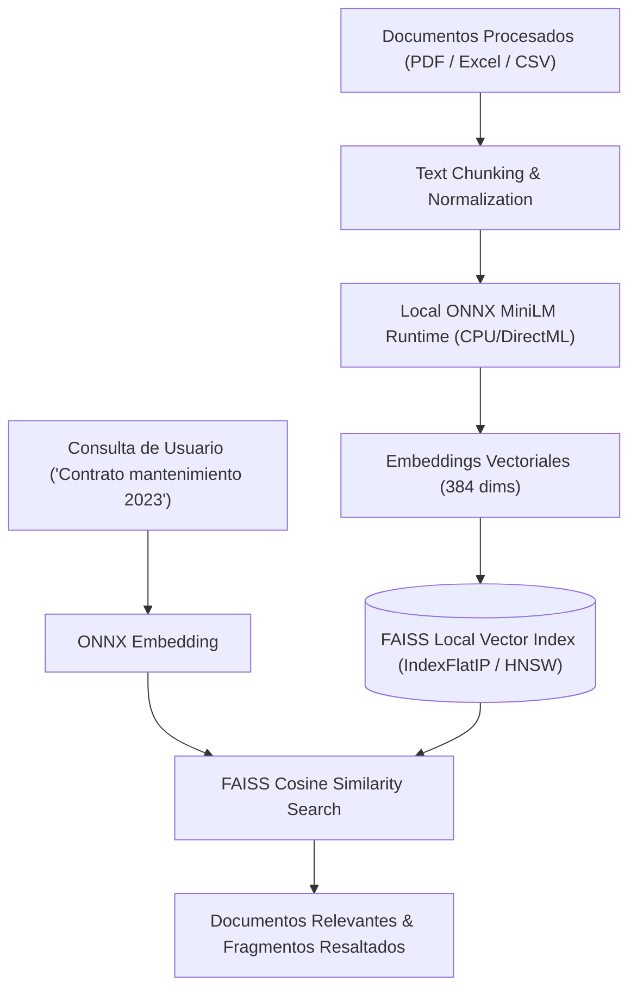

# 07 — Búsqueda Semántica Local, Cumplimiento Fiscal & Seguridad Forense

Este documento define la arquitectura de **búsqueda semántica 100% offline**, **cumplimiento normativo fiscal (SII / Veri\*factu)** y **protección de datos (RGPD / PII)** en **FlowMind AI**.

---

## 1. Búsqueda Semántica Vectorial 100% Offline

### 1.1 Principio Rector
Permitir consultas en lenguaje natural sobre todo el repositorio documental de la empresa **sin enviar vectores ni texto a servicios en la nube (Zero Cloud Data Leakage)**.



### 1.2 Stack Técnico Local
* **Modelo de Embeddings:** `all-MiniLM-L6-v2` o `paraphrase-multilingual-MiniLM-L12-v2` exportado a formato **ONNX cuantizado (INT8)** (~45 MB de peso en disco).
* **Motor de Inferencia:** `onnxruntime` optimizado para ejecución en CPU sin requerir tarjeta gráfica dedicada.
* **Índice Vectorial:** `FAISS` (`faiss-cpu`) con persistencia local en disco bajo `./data/indices/{organization_id}/documents.index`.

### 1.3 Detección de Documentos Duplicados (*Near-Duplicate SimHash*)
* Para evitar almacenar y procesar documentos redundantes o identificar revisiones de contratos:
  * Generación de huellas dactilares mediante algoritmo **SimHash (64 bits)** sobre n-gramas de texto.
  * Cálculo de la distancia Hamming: Si $\text{distancia} \le 3$, los documentos se clasifican como *Duplicados Cuasi-Idénticos*.

---

## 2. Cumplimiento Fiscal & Normativo (España / UE)

### 2.1 Módulo SII — Suministro Inmediato de Información (AEAT)
* **Objetivo:** Transformar automáticamente los datos extraídos de facturas expedidas y recibidas en el esquema XML oficial exigido por la Agencia Tributaria española (AEAT).
* **Campos Generados:**
  * Identificación del emisor y receptor (NIF / CIF).
  * Clave de régimen especial (01 General, 02 Exportación, etc.).
  * Tipo impositivo de IVA y cuota desglosada por recargo de equivalencia.
  * Número de factura y fecha de operación.
* **Validación de Esquema:** Verificación determinista contra el esquema XSD oficial de la AEAT antes de la exportación.

### 2.2 Trazabilidad Inmutable & Hash Chaining (*Veri\*factu / TicketBAI*)
* **Objetivo:** Cumplir con los requisitos de inalterabilidad y encadenamiento de registros de facturación de la Ley Antifraude y reglamentos técnicos *Veri\*factu* y *TicketBAI*.
* **Estructura del Bloque de Registro:**
  $$\text{Hash}_{n} = \text{SHA-256}\Big(\text{Hash}_{n-1} \,\|\, \text{CIF} \,\|\, \text{NumFactura} \,\|\, \text{FechaHora} \,\|\, \text{ImporteTotal} \,\|\, \text{CuotaIVA}\Big)$$
* Cada factura procesada se sella con el hash del registro anterior, generando una cadena a prueba de manipulaciones (*Tamper-Evident Ledger*).

---

## 3. Anonimizador y Redactor de Datos Sensibles (PII / LOPD / RGPD)

### 3.1 Clases de Datos Protegidos
El motor `PIIRedactor` detecta y enmascara automáticamente:
* **Identificadores Personales:** DNI, NIE, Pasaporte, NIF.
* **Datos Bancarios:** Códigos IBAN y números de tarjeta de crédito (algoritmo de Luhn).
* **Datos de Contacto:** Direcciones de email particulares y números de teléfono móvil.
* **Direcciones IP:** IPv4 e IPv6 privadas y públicas.

### 3.2 Estrategias de Redacción
1. **Enmascaramiento Parcial:** `ES91 2100 **** **** **** 4589` / `***45129K`.
2. **Pseudonimización:** Sustitución por identificadores deterministas (`USER_ANON_8f8b8946`).
3. **Redacción Visual en PDF:** Superposición de rectángulos negros opacos permanentes sobre las coordenadas geométricas del texto en el PDF vectorial (`PyMuPDF redact_annot`).

---

## 4. `FlowMind Portable` — Edición USB para Auditorías Forenses

### 4.1 Caso de Uso
Inspectores fiscales, auditores contables y peritos que realizan intervenciones in-situ en oficinas cliente con prohibición estricta de conexión a internet o instalación de software en los equipos locales.

### 4.2 Arquitectura del Paquete Portable
* **Estructura en Memoria USB:**
  ```text
  FlowMind-Portable/
  ├── runtime/                # Python 3.11 embebido (Windows standalone)
  ├── bin/
  │   └── FlowMindPortable.exe# Lanzador PySide6 nativo
  ├── data/                   # Almacenamiento local temporal en USB
  │   ├── flowmind.db         # Base de datos SQLite cifrada con SQLCipher
  │   └── storage/            # Carpeta aislada de archivos procesados
  └── README.txt
  ```
* **Cero Huella en Host:** No escribe en el registro de Windows ni deja archivos temporales en el disco duro del equipo anfitrión al cerrar la sesión.
